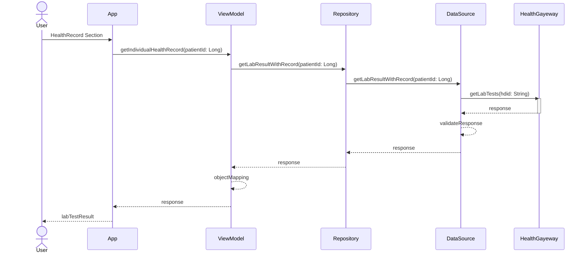

```mermaid
sequenceDiagram
 actor U as User
 participant A as App
 participant V as ViewModel
 participant R as Repository
 participant D as DataSource
 participant H as HealthGayeway
 U->>A: HealthRecord Section
 A->>V: getIndividualHealthRecord(patientId: Long)
 V->>R: getLabResultWithRecord(patientId: Long)
 R->>D: getLabResultWithRecord(patientId: Long)
 D->>H: getLabTests(hdid: String)
 activate H
 H-->>D: response
 deactivate H
 D-->>D: validateResponse
 D-->>R: response
 R-->>V: response
 V-->>V: objectMapping
 V-->>A: response
 A-->>U: labTestResult
```